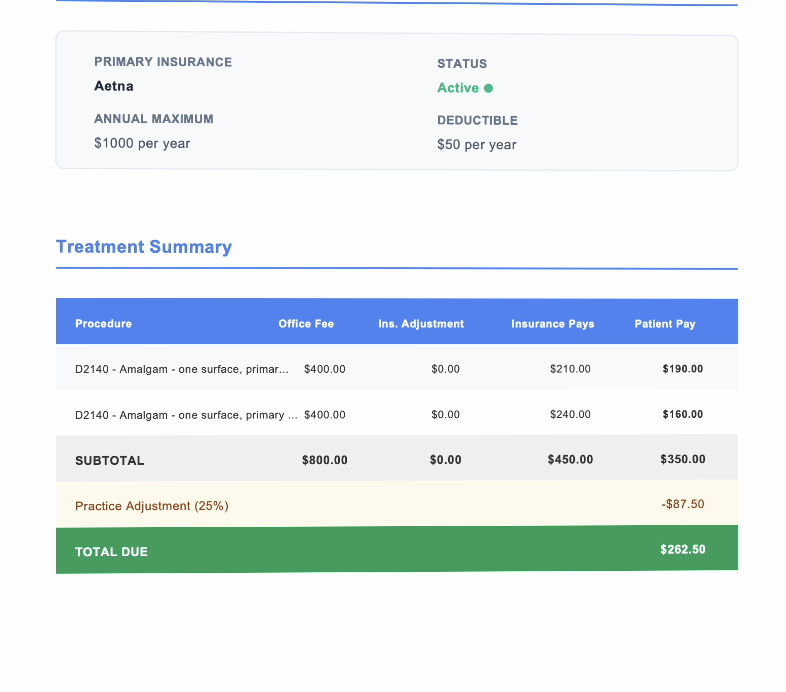
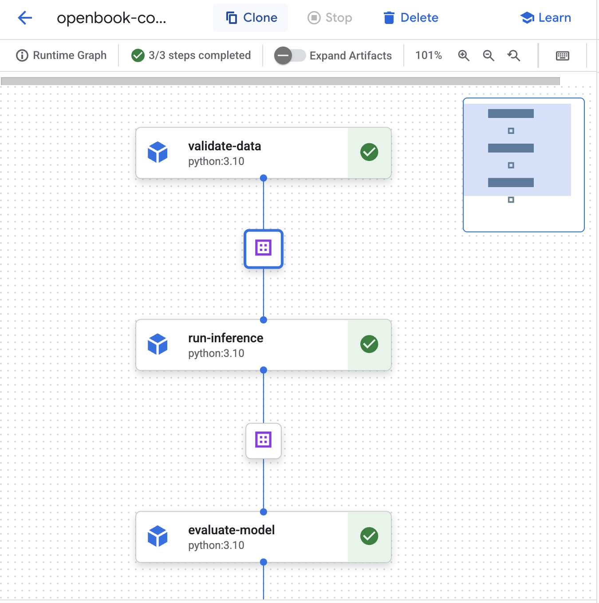
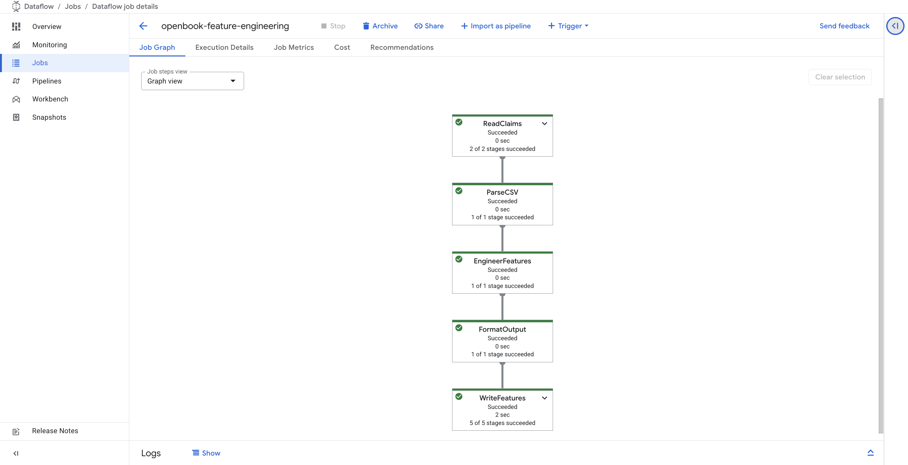
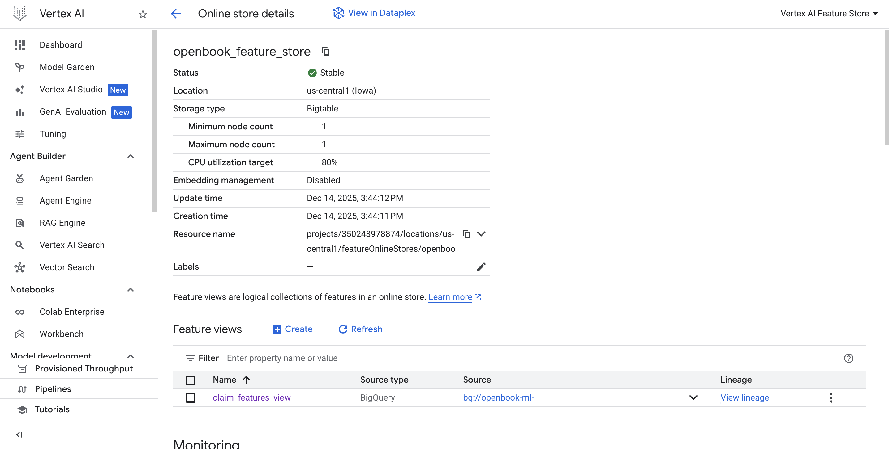
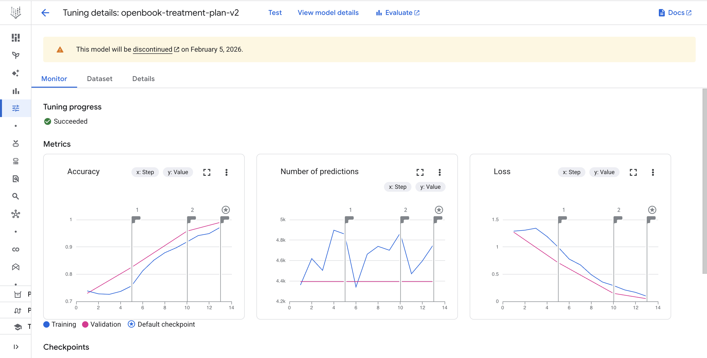
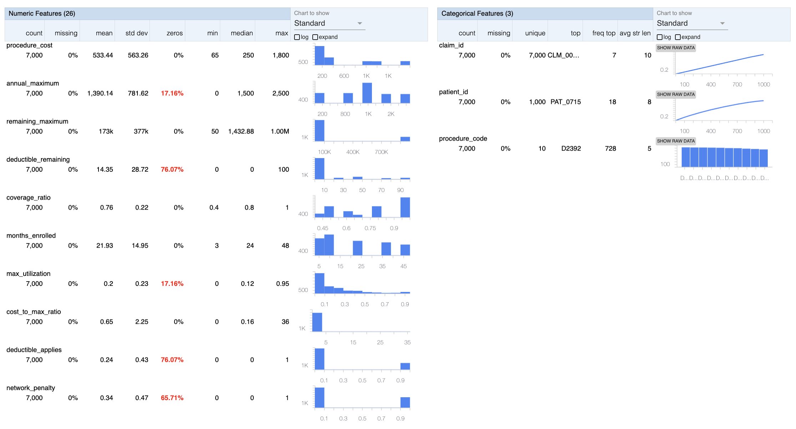
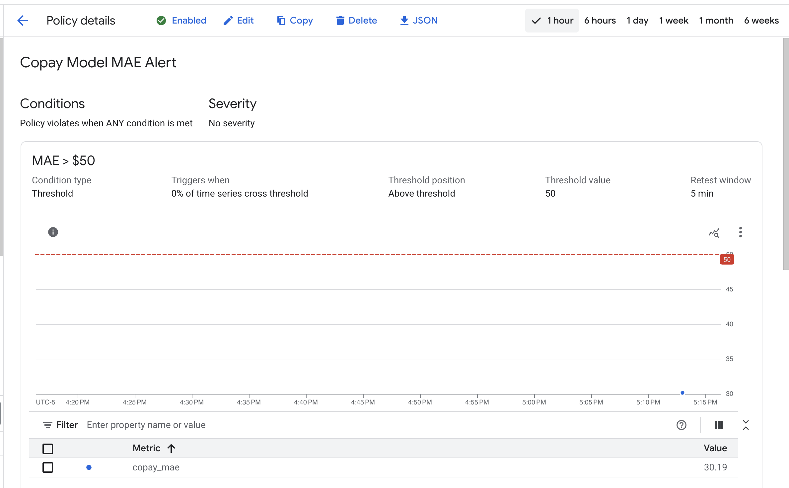
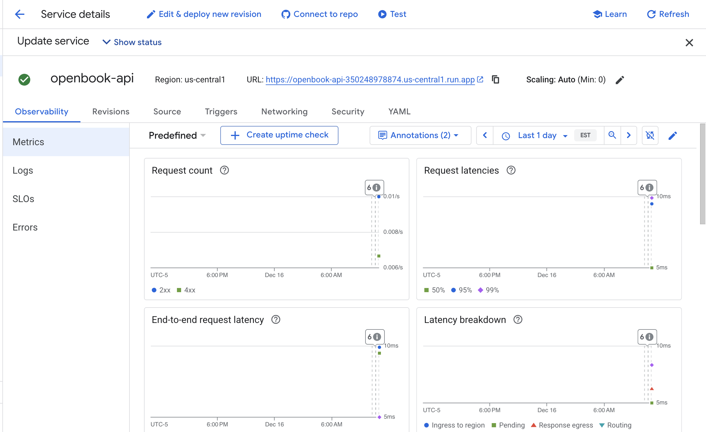

# Openbook - Dental Copay Prediction & Treatment Plan Generation (MLOps Pipeline)

**[Live Demo](https://openbook-streamlit-350248978874.us-central1.run.app/)** | Attention-based neural networks for copay prediction and fine-tuned Gemini for treatment plan generation on Google Cloud Platform

---

## The Problem

Dental practices waste 4+ hours daily on insurance verification and treatment plan generation. Staff manually call insurance companies, look up benefits, and calculate patient costs. This leads to:
- **Billing errors** → claim denials and revenue loss
- **Poor patient experience** → unexpected costs at checkout
- **Staff burnout** → repetitive, low-value work

## The Solution

Built an ML pipeline that predicts patient copays and generates professional treatment plan letters. The production system (Openbook) integrates with practice management software and insurance APIs. This repository demonstrates the MLOps infrastructure powering those predictions.



---

## Demo vs Production

| Aspect | This Demo | Production (Openbook) |
|--------|-----------|----------------------|
| **Insurance Data** | Coverage rates from historical training data | Real-time extraction via [Stedi API](https://www.stedi.com/) |
| **Patient Data** | Manual form input | CSV upload with batch processing (100+ patients) |
| **Treatment Plans** | Display in browser | PDF generation with automated email delivery |
| **Deployment** | Public Streamlit demo | Authenticated portal with FastAPI backend (slightly different model due to demo v production needs) |

---

## Results

| Metric | Value |
|--------|-------|
| **Copay MAE** | $30.19 |
| **Copay R²** | 0.959 |
| **Insurance MAE** | $33.07 |
| **Insurance R²** | 0.918 |

**Multi-output architecture** predicts both patient copay and insurance payment simultaneously, improving accuracy through multi-task learning.

---

## Key Technical Decisions

### 1. Attention-Based Architecture Over Traditional ML
Used self-attention to dynamically weight feature importance based on context. When remaining annual maximum is low, the model attends more heavily to that feature. Traditional MLPs apply fixed weights regardless of context.

### 2. Multi-Output Learning
Single forward pass predicts both copay and insurance payment. Shared encoder learns better representations than separate models.

### 3. Vertex AI Vizier for Hyperparameter Tuning
Ran 12 trials optimizing embedding dimension, attention heads, dropout, and learning rate. Improved MAE from $33.96 baseline to $30.19 (11% reduction).

### 4. Fine-Tuned Gemini for Treatment Plans
Supervised fine-tuning on 80 examples teaches Gemini dental-specific formatting, terminology, and professional tone. Generates patient-ready letters with cost breakdowns and payment options.

---

## Architecture


```
+------------------+     +-------------------+     +------------------+
|   Cloud Storage  |---->|  Dataflow Batch   |---->|  Feature Store   |
|    Data Lake     |     |    Processing     |     |  (Online Serving)|
+------------------+     +-------------------+     +--------+---------+
                                                           |
                                                           v
+------------------+     +-------------------+     +------------------+
|  Vertex AI Vizier|---->| PyTorch Lightning |---->|   MLflow         |
|   HP Tuning      |     |  Model Training   |     |   Tracking       |
+------------------+     +-------------------+     +--------+---------+
                                                           |
                                                           v
+------------------+     +-------------------+     +------------------+
|   TFDV Schema    |     | Kubeflow Pipeline |     |   Evidently AI   |
|   Validation     |<----|  (Continuous Eval)|---->|  Drift Detection |
+------------------+     +-------------------+     +--------+---------+
                                                           |
                                                           v
+------------------+     +-------------------+     +------------------+
| Cloud Monitoring |---->|     Pub/Sub       |---->|    Cloud Run     |
|     Alerts       |     |   Retrain Trigger |     |   Retraining     |
+------------------+     +-------------------+     +------------------+


                      SERVING ARCHITECTURE

+------------------+     +-------------------+     +------------------+
|    Streamlit     |---->|  FastAPI on       |---->| Fine-tuned       |
|    Frontend      |     |  Cloud Run        |     | Gemini 2.0       |
+------------------+     +-------------------+     +------------------+
```

---

## Pipeline Components

### Data Processing


Dataflow batch pipeline processes raw claims data, engineers features, and loads to Feature Store for online serving.

### Feature Store


Vertex AI Feature Store provides millisecond-latency feature lookups for real-time predictions.

### Model Training & Tuning


Fine-tuned Gemini 2.0 Flash on 80 treatment plan examples. The model generates professional letters with procedure details, insurance coverage, and payment options.

### Data Validation


TFDV validates incoming data against training schema, catching anomalies before they reach the model.


### Monitoring & Drift Detection


Evidently AI monitors for data drift. When detected, triggers Pub/Sub message to initiate retraining.



Cloud Monitoring alerts when model MAE exceeds threshold.

### Deployment


FastAPI backend and Streamlit frontend deployed on Cloud Run with CI/CD via Cloud Build.

---

## Tech Stack

| Category | Technologies |
|----------|-------------|
| **Modeling** | Attention-based multi-output neural network (PyTorch Lightning), Gemini SFT, Vertex AI Vizier |
| **Data** | Cloud Storage data lake, Dataflow batch processing, Feature Store |
| **Orchestration** | Kubeflow Pipelines (continuous evaluation), TFDV (TFX) |
| **Deployment** | FastAPI on Cloud Run, Streamlit, Cloud Build CI/CD, Terraform |
| **Monitoring** | MLflow, Cloud Monitoring alerts, Evidently AI drift, Pub/Sub + Cloud Run retraining |

---

## Project Structure
```
openbook-ml-demo/
├── README.md
├── requirements.txt
├── cloudbuild.yaml
├── notebooks/
│   ├── 01-synthetic-data-generation.ipynb
│   ├── 02-dataflow-feature-pipeline.ipynb
│   ├── 03-feature-store-setup.ipynb
│   ├── 04-attention-model-training.ipynb
│   ├── 05-gemini-finetuning.ipynb
│   ├── 06-kubeflow-pipeline.ipynb
│   ├── 07-monitoring-setup.ipynb
│   └── 08-deployment.ipynb
├── cloud_run/
│   ├── api/
│   │   ├── main.py
│   │   ├── Dockerfile
│   │   └── requirements.txt
│   └── streamlit/
│       ├── app.py
│       ├── Dockerfile
│       └── requirements.txt
├── terraform/
│   ├── main.tf
│   └── variables.tf
└── screenshots/
```

---

## The Journey

This project started as a way to demonstrate the ML infrastructure behind Openbook, a dental insurance verification + treatment planning SaaS platform I built. The goal was to show production ML engineering skills - not just model training, but the full pipeline from data processing to monitoring.

Key learnings:
- **Attention mechanisms work for tabular data.** Dynamic feature weighting outperformed static MLP approaches.
- **Multi-task learning helps.** Predicting copay and insurance payment together improved both predictions.
- **Fine-tuning LLMs is accessible.** 80 examples were enough to teach Gemini domain-specific formatting.
- **The pipeline is the product.** Model accuracy matters, but reliable data flow, monitoring, and retraining matter more in production.

---

## Author

**Arion Farhi** - [GitHub](https://github.com/arion-farhi) | [LinkedIn](https://linkedin.com/in/arionfarhi)
